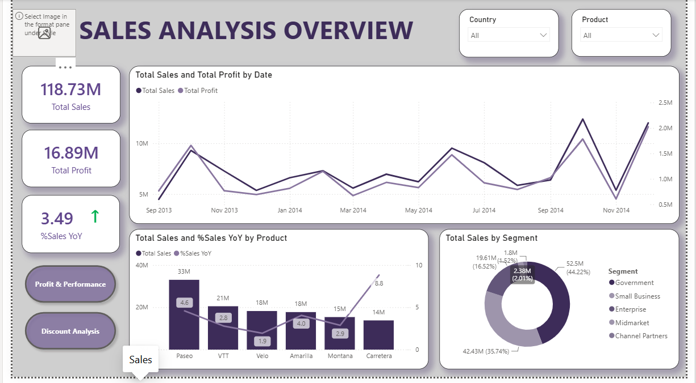
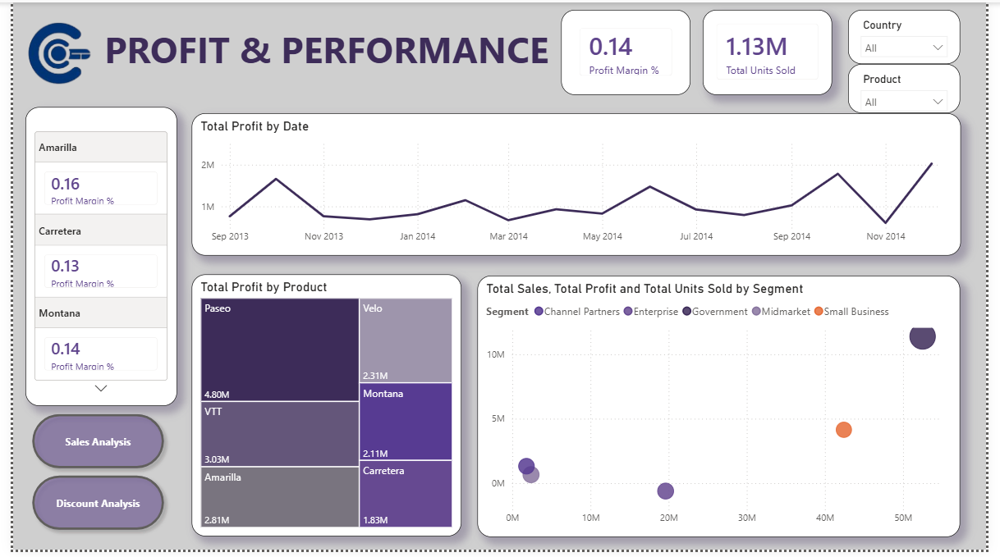
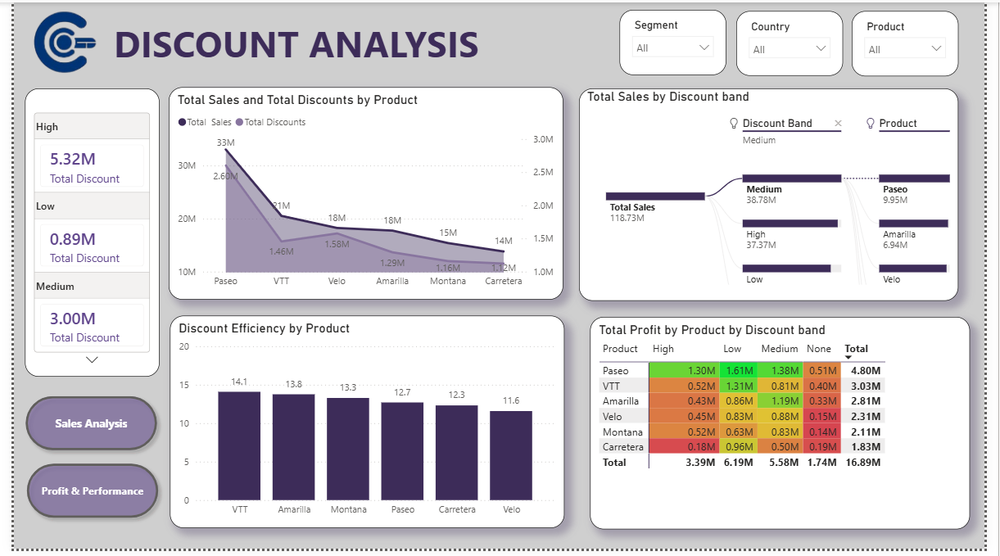

# 📊 Sales Performance Dashboard

## 📌 Project Overview

This project presents an interactive Sales Performance Dashboard built using Power BI to analyze sales performance across different countries, products, customer segments, and time periods. The dashboard transforms raw sales data into meaningful business insights that support strategic decision-making.

The project focuses on tracking revenue, profit, sales trends, discount impact, and product performance through dynamic visualizations and KPI-driven reporting.

---

# 🎯 Business Objectives

The primary objectives of this project are to:

- Monitor overall sales performance
- Analyze profit across different products and countries
- Identify top-performing customer segments
- Evaluate the impact of discounts on profitability
- Track monthly and yearly sales trends
- Support business decision-making through interactive dashboards

---

# 🛠️ Technologies Used

| Technology | Purpose |
|------------|---------|
| Power BI Desktop | Dashboard Development |
| Power Query | Data Cleaning & Transformation |
| DAX | KPI Calculations |
| Microsoft Excel | Data Source |
| Data Modeling | Relationship Management |

---

# 📂 Dataset Information

### Dataset Summary

- **Total Records:** 700
- **Total Columns:** 16

### Dataset Includes

- Customer Segment
- Country
- Product
- Discount Band
- Units Sold
- Manufacturing Price
- Sale Price
- Gross Sales
- Discounts
- Sales
- Cost of Goods Sold (COGS)
- Profit
- Date
- Month
- Year

---

# 📈 Key Performance Indicators (KPIs)

The dashboard tracks the following business KPIs:

- Total Sales
- Total Profit
- Gross Sales
- Total Discounts
- Units Sold
- Profit Margin
- Average Sales per Product
- Country-wise Revenue

---

# 📊 Dashboard Features

The Power BI dashboard provides interactive visualizations including:

- Executive Sales Overview
- Monthly Sales Trend Analysis
- Profit Analysis
- Country-wise Sales Performance
- Product-wise Sales Analysis
- Customer Segment Analysis
- Discount Band Analysis
- Interactive Filters & Slicers
- KPI Cards

---

# 📌 Business Questions Answered

This dashboard helps answer key business questions such as:

- Which country generates the highest sales?
- Which products contribute the most revenue?
- Which customer segment is the most profitable?
- How do discounts affect profitability?
- What are the monthly and yearly sales trends?
- Which products have the highest profit margins?
- Which regions require business attention?
- Which discount bands maximize revenue without reducing profit?

---

# 📊 Dashboard Preview

## Executive Dashboard







---

# 📈 Key Business Insights

- Identified top-performing countries based on total sales.
- Compared product profitability across different markets.
- Evaluated the relationship between discounts and profit.
- Tracked seasonal sales trends using monthly analysis.
- Measured customer segment performance.
- Highlighted products generating the highest revenue.

---

# 💡 Business Recommendations

- Focus marketing efforts on high-performing countries.
- Increase inventory for top-selling products.
- Optimize discount strategies to improve profit margins.
- Develop targeted campaigns for low-performing customer segments.
- Monitor seasonal demand for better inventory planning.
- Prioritize high-margin products in future sales strategies.

---

# 📁 Repository Structure

```
Sales-Performance-Dashboard
│
├── Sales Performance Dashboard.pbix
├── Sales_Data.xlsx
├── README.md
│
├── screenshots
│   ├── Sales Overview.png
│   ├── Profit Analysis.png
│   └── Discount Analysis.png
│

```

---

# 🎯 Skills Demonstrated

- Data Cleaning
- Data Transformation
- Power Query
- DAX
- Data Modeling
- KPI Development
- Dashboard Design
- Business Intelligence
- Data Visualization
- Analytical Thinking

---

# 🚀 Future Enhancements

- Sales Forecasting using Machine Learning
- Customer Segmentation with Python
- Predictive Revenue Analysis
- Integration with SQL Database
- Real-time Sales Dashboard using Power BI Service

---

# 👩‍💻 Author

**Karanki Lahari**

**Skills:** Power BI | SQL | Python | Excel | Data Analytics | Business Intelligence

---

## ⭐ If you found this project useful, consider giving it a star!
